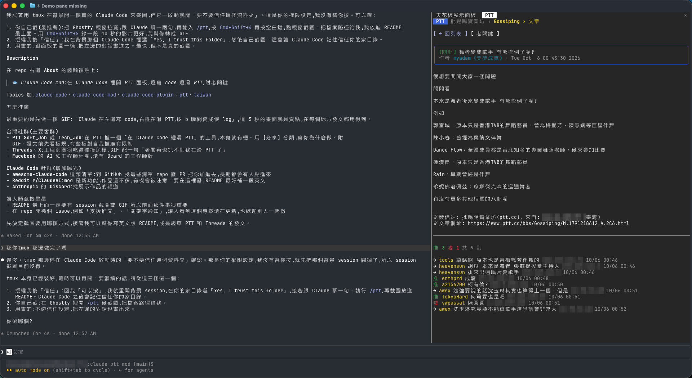
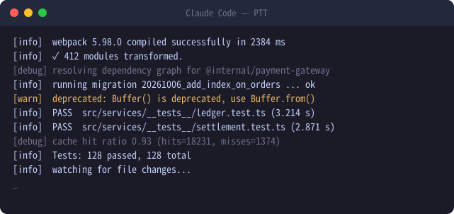
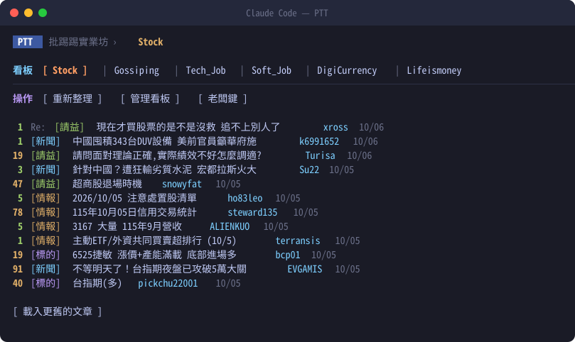
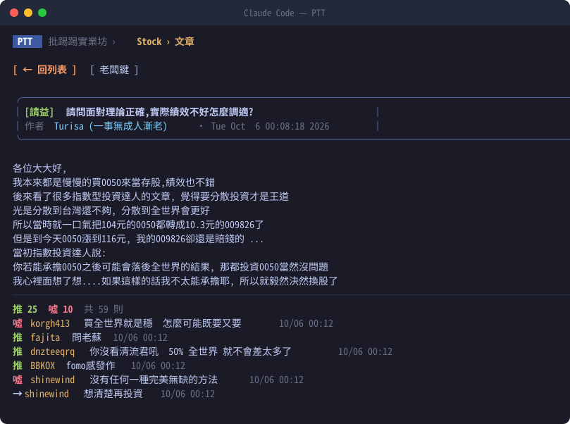
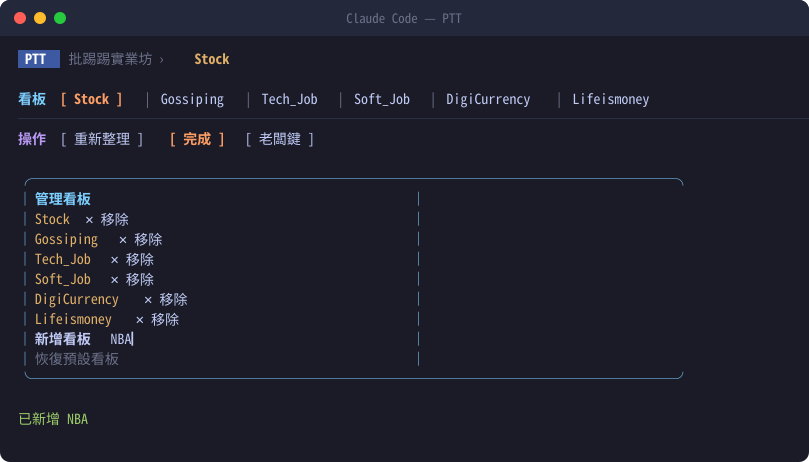

# 🐟 claude-ptt-mod

**一個 Claude Code mod:在 [Claude Code](https://claude.com/claude-code) 裡面開一個 PTT 面板,邊跟 Claude 寫 code 邊滑 PTT。**


🌐 **網站:<https://chenyao0910.github.io/claude-ptt-mod/>**(可以在網頁上試玩老闆鍵)

Claude 在跑測試、改檔案的時候,你不用切到瀏覽器:面板就在對話旁邊,看看盤後閒聊、刷一下八卦。老闆經過?按 `b`,整個面板瞬間變成一堆編譯 log。



<sub>實際使用畫面:左邊照常跟 Claude 對話,右邊的 PTT 面板正在看八卦板文章。截圖中的使用者資訊和推文 IP 已遮蔽。</sub>

## 什麼是 Claude Code mod?

Claude Code 的 plugin 除了能提供 skill 和指令,還能用 **function hooks** 直接改 Claude Code 自己的介面:畫面板(pane)、在輸入框上方加一列、顯示 toast、改狀態列、攔截工具呼叫等等。這類「改 Claude Code 本身」的 plugin 就叫 **mod**。

這個 mod 用到的功能:

| Claude Code 功能 | 在這個 mod 裡的用途 |
| --- | --- |
| 面板(`ui.render` 的 `Pane`) | PTT 文章列表、文章內頁、老闆鍵畫面 |
| 斜線指令(`command.register`) | `/ptt`、`/ptt add`、`/ptt remove` |
| 面板快捷鍵(Button `hotkey`) | `b` 老闆鍵、`r` 重新整理…… |
| 跨 session 儲存(`$.store`) | 記住你自訂的看板清單 |
| 網路請求(`$.http.fetch`) | 讀取 PTT 網頁版 |

程式全部在 [`plugins/ptt/hooks/`](plugins/ptt/hooks/),大約 300 行 TypeScript,想學怎麼寫 mod 可以從這裡看起。

## 功能

- 看板文章列表:推文數上色(爆 / 10+ / 一般 / X),分類標籤上色,一路往前載入更舊的文章
- 文章閱讀:內文、推 / 噓統計、推文列表
- 自訂看板:新增、移除、恢復預設,關掉 Claude Code 再開還在
- 老闆鍵:一鍵把面板換成一堆看起來很忙的編譯和測試 log
- 免登入,八卦版的「已滿 18 歲」確認自動處理

## 教學

### 1. 確認 Claude Code 版本

```sh
claude --version
```

需要 **2.1.289 以上**,舊版不支援 mod 的面板功能。太舊的話先執行 `claude update`。

### 2. 安裝

在終端機執行(不是在 Claude Code 對話裡):

```sh
claude plugin marketplace add chenyao0910/claude-ptt-mod
claude plugin install ptt@claude-ptt-mod
```

第一行把這個 repo 加成 plugin 來源,第二行安裝裡面的 `ptt` mod。

### 3. 打開 Claude Code,叫出面板

照平常一樣啟動 `claude`。如果 Claude Code 本來就開著,先在對話裡執行 `/reload-plugins`。

在輸入框打:

```
/ptt
```

面板會出現在 Claude Code 裡,顯示 Stock 板的最新文章。想直接看別的板:

```
/ptt Gossiping
```

> 💡 終端機寬一點比較好看,建議 **144 欄以上**,面板才放得下又不擠到對話。

### 4. 看文章

- **滑鼠**:點文章標題就會打開,點「← 回列表」回去
- **鍵盤**:先按 `ctrl+x` 再按 `tab`,讓面板取得焦點,接著就能用快捷鍵

| 鍵 | 作用 |
| --- | --- |
| `b` | 老闆鍵(再按一次切回來) |
| `r` | 重新整理 |
| `n` | 載入更舊的文章 |
| `h` | 從文章回到列表 |
| `e` | 管理看板 |

面板有焦點時,你打的字會給面板而不是對話。想回去跟 Claude 講話,點一下輸入框,或再按一次 `ctrl+x` `tab` 切換。

### 5. 換成你常逛的看板

預設看板是 Stock、Gossiping、Tech_Job、Soft_Job、DigiCurrency、Lifeismoney。改成你自己的:

**方法 A:在面板裡改**

1. 按「管理看板」(或快捷鍵 `e`)
2. 不要的看板按「✕ 移除」
3. 在「新增看板」輸入英文板名(例如 `NBA`),按 Enter
4. 按「完成」

**方法 B:用指令**

```
/ptt add NBA
/ptt remove Soft_Job
```

板名不分大小寫,打 `nba` 會自動修正成 PTT 上的正式名稱 `NBA`;打錯的板名會直接告訴你找不到。改過的清單會存下來,下次開 Claude Code 還在。

### 6. 老闆來了

按 `b`(或面板上的「老闆鍵」),面板立刻變成這樣:



再按一次 `b`,或點最下面那個灰色的 `_`,就會回到剛剛看的地方。

### 7. 更新與移除

```sh
claude plugin update ptt@claude-ptt-mod      # 更新到最新版
claude plugin uninstall ptt@claude-ptt-mod   # 移除
```

## 畫面



| 文章內頁 | 管理看板 |
| --- | --- |
|  |  |

> 面板的圖是照實際排版畫的,列表和文章用的是 PTT Stock 板的實際資料。實際顏色會依你的終端機配色而不同。

## 限制

- 只能看,不能推文或發文
- 面板一次能畫的字數有限:內文超過 6000 字會截斷,推文只顯示最後 150 則
- 資料來自 PTT 網頁版 `www.ptt.cc`,只在你打開看板或文章時才抓。PTT 改版的話解析可能會壞,歡迎開 issue

## 開發

```sh
claude plugin validate plugins/ptt   # 檢查 manifest 和 hooks
claude plugin test plugins/ptt       # 跑測試
claude --plugin-dir ./plugins/ptt    # 不安裝,直接載入本機版本試跑
```

用 `--plugin-dir` 載入時,改完存檔 mod 會自動重新載入,不用重開 Claude Code。

重新產生 README 的圖片(用 PTT 現在的資料):

```sh
npx tsx scripts/dump-live.mts Stock > /tmp/live.json
python3 scripts/make-screenshots.py /tmp/live.json
```

## 授權

MIT
